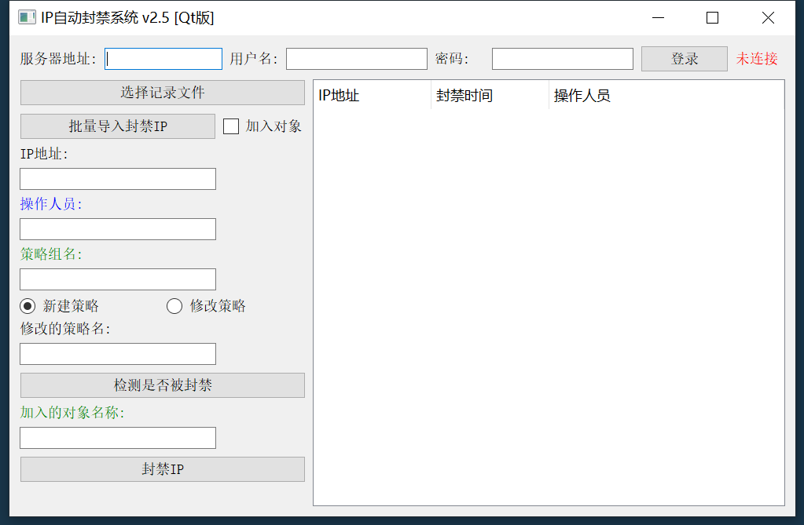
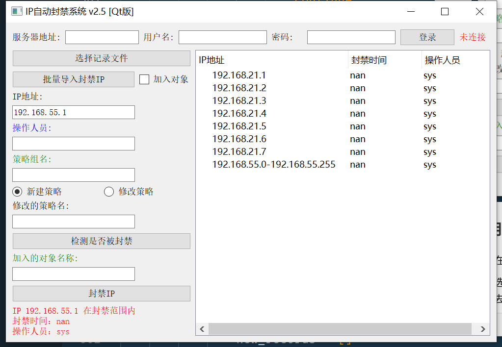

# 1. 深信服防火墙批量封禁工具

## 使用方法：

    1. 在服务器地址栏中 只输入防火墙的IP即可 例如 https://192.168.0.1 只需输入 192.168.0.1 即可。

2. 选择记录文件功能：[已封禁IP表.xlsx]为模板文件，在此表中的ip 不会再次被封禁，也可当作白名单使用，会自动去重，支持地址段 例如(192.168.2.1-192.168.2.255)

3. 批量导入封禁IP功能：[批量封禁IP表.xlsx]为模板文件，在此表中的ip地址，检查是否在已封禁的ip表中。
   
   1. 加入对象：选中此功能，就会把当前批量封禁的ip表加入已有的对象中，并不会自动创建新对象。
      注意：此功能只能导入 190个IP，大于190并不会自动创建对象。
      一个对象中只能存放200个IP，当检测不足以加入对象时会提示报错。
   
   2. 不勾选使用加入对象：就会创建新的策略和新的对象，IP个数大于200个时，会自动创建多个对象，并且不会把在已封禁IP表中的IP所封禁。

4. 新键策略：选中此功能，封禁单个IP和批量导入封禁IP时就会自动创建新测率和新对象。
     必须填写策略组名，无需加入策略组名前面的编号 例如：（1.封禁IP） ，只需填写 封禁IP 即可
   
   1. 创建的测率名为：POLICY_BLOCK_ 开头加上当前日期 (20250525) 
   
   2. 创建的对象名为：BLOCK_ 开头加上当前日期 (20250525)

5. 检测是否被封禁：此功能会读取IP地址输入栏中的IP去检测，并在左下角显示出信息

6. 封禁IP：此功能用于封禁IP地址输入栏中的IP，作用是封禁单个IP
   
   1. 当选择修改策略时，点击封禁IP 就会把当前IP加入 所填写的对象名称中，
   
   2. 选择新建测率，就会新建策略和新建对象

7. 当登入后，每隔1小时就会自动保持token

8. 点击 服务器地址 即可统计当天封禁的ip个数

